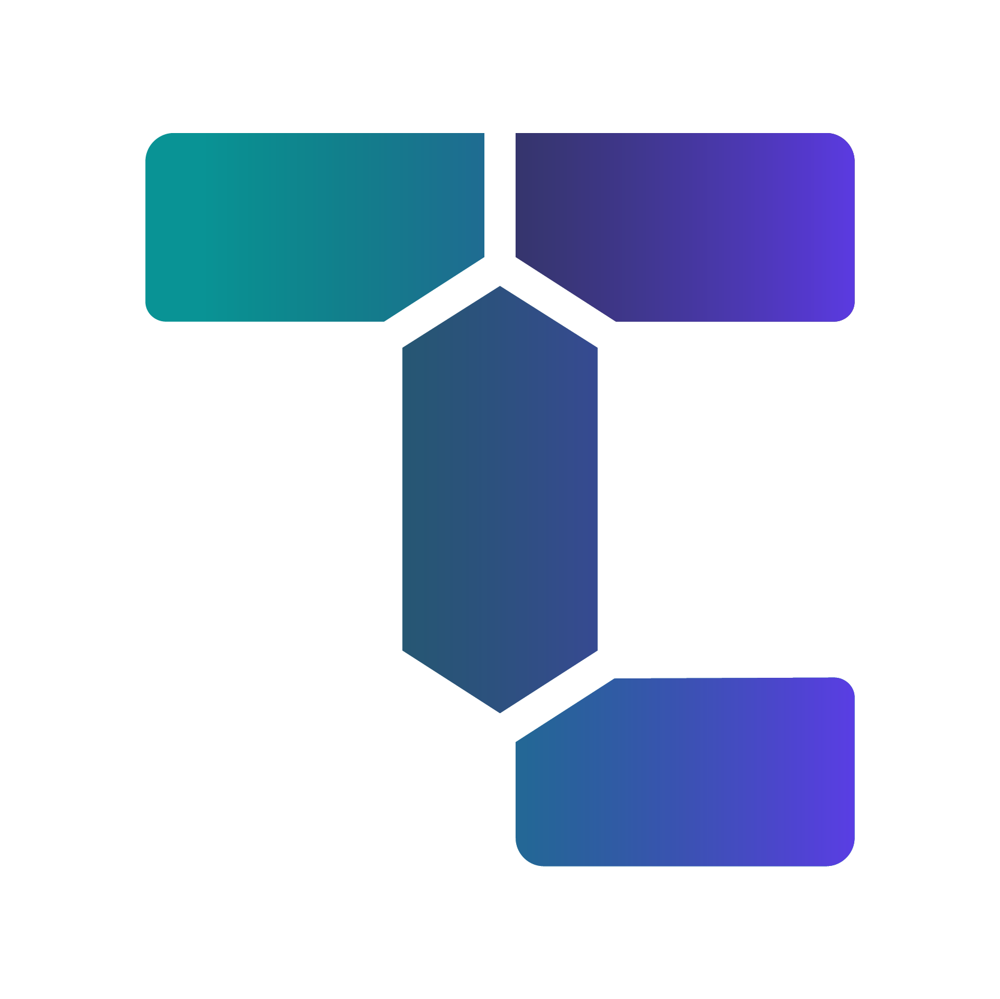

<p align="center">
  
</p>

# TerraCost

[](https://pkg.go.dev/github.com/cycloidio/terracost)

Go library for estimating Terraform costs using ingested cloud vendor prices. It is meant to be imported and used by programs (API's or standalone) with access to a MySQL-compatible database and the Internet.

## Installation

```shell
go get github.com/cycloidio/terracost
```

## Requirements

- Go 1.15 or newer (older may work but are not supported)
- MySQL database

## Provider support

Currently, Terracost supports only a few resources of the AWS provider, however we're actively working on adding more support. See the full list of supported resources [on this wiki page](https://github.com/cycloidio/terracost/wiki/Supported-Resources).

## Usage

### Migrating the database

```go
db, err := sql.Open("mysql", "...")

// Can be called on every start of your program, it does nothing if the migrations
// have been executed already.
err := mysql.Migrate(ctx, db, "pricing_migrations")
```

### Ingesting pricing data

```go
db, err := sql.Open("mysql", "...")
backend := mysql.NewBackend(db)

// service can be "AmazonEC2" or "AmazonRDS"
// region is any AWS region, e.g. "us-east-1" or "eu-west-3"
ingester, err := aws.NewIngester(service, region)
err = terracost.IngestPricing(ctx, backend, ingester)
```

### Tracking ingestion progress

We're using the `github.com/machinebox/progress` library for tracking ingestion progress.

1. Create a channel that will receive progress updates and set up a goroutine (it will print the bytes ingested out of bytes total and remaining time each time progress update is sent on the channel):

```go
progressCh := make(chan progress.Progress, 0)

go func() {
	for p := range progressCh {
		// Check the docs for all available methods: https://pkg.go.dev/github.com/machinebox/progress#Progress
		fmt.Printf("%d / %d (%s remaining)\n", p.N(), p.Size(), p.Remaining().String())
	}
}()
```

2. Initialize an ingester capable of tracking progress (in this example the channel will receive an update every 5 seconds):

```go
ingester, err := aws.NewIngester(service, region, aws.WithProgress(progressCh, 5*time.Second))
```

3. Use the ingester as in the previous section.

### Estimating a Terraform plan

Plan estimation is possible after all the relevant pricing data have been ingested and stored in the
database.

1. Generate a plan using `terraform` and convert it to JSON:

```shell
terraform plan -out update.tfplan
terraform show -json update.tfplan > tfplan.json
```

2. Read the plan file, estimate it and show the resource differences:

```go
db, err := db.Open("mysql", "...")
backend := mysql.NewBackend(db)

file, err := os.Open("path/to/tfplan.json")
plan, err := terracost.EstimateTerraformPlan(ctx, backend, file)

for _, res := range plan.ResourceDifferences() {
    fmt.Printf("%s: %s -> %s\n", res.Address, res.PriorCost().String(), res.PlannedCost().String())
}
```

Check the documentation for all available fields.

## Contributing

For Contributing Guide, please read [CONTIBUTING.md](CONTRIBUTING.md).

## License

This project is licensed under the MIT license. Please see [LICENSE](LICENSE) for more details.
